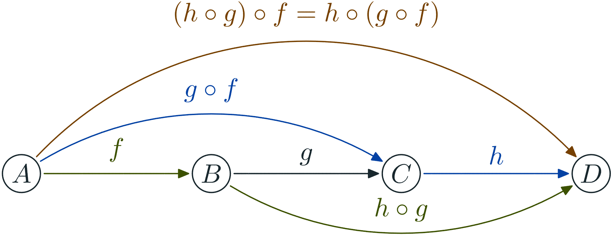

# Generate graph in PNG using metapost

First you need to install `LaTeX`, `metapost` and `imagemagick`.

Then this repo provide a metapost lib to draw automata using LaTeX labels.
Then the script use the solarized color theme and also generate PNG optimized for the web.

## Example

~~~
z0=origin;
z1=(gu,0);
z2=(2gu,0);
z3=(3gu,0);

drawState(z0,"A");
drawState(z1,"B");
drawState(z2,"C");
drawState(z3,"D");

drawEdge(z1,z2,"g");

drawoptions(withcolor blue);
drawEdgeAngle(z0,z2,"g\circ f",35);
drawEdge(z2,z3,"h");

drawoptions(withcolor green);
drawEdge(z0,z1,"f");
drawEdgeAngle(z1,z3,"h\circ g",-35);

drawoptions(withcolor yellow);
drawEdgeAngle(z0,z3,"(h\circ g)\circ f = h\circ (g\circ f)",50);
~~~

Generate the following image:

 

